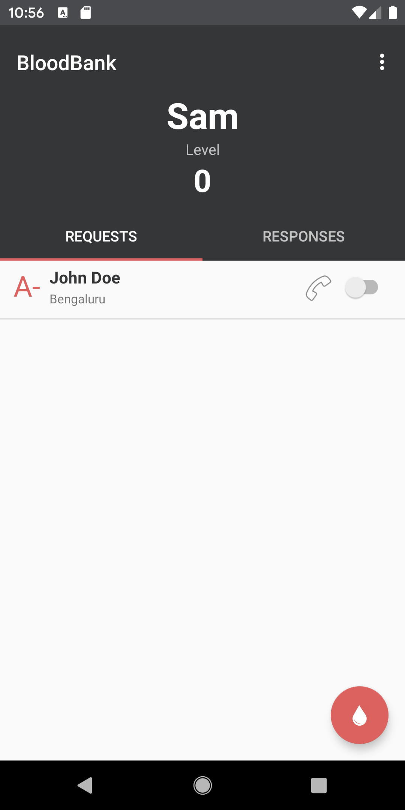
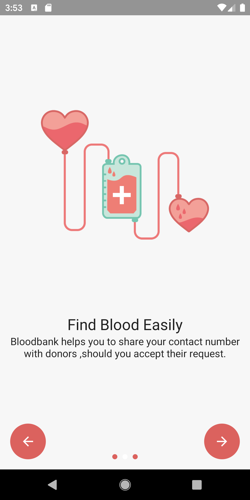
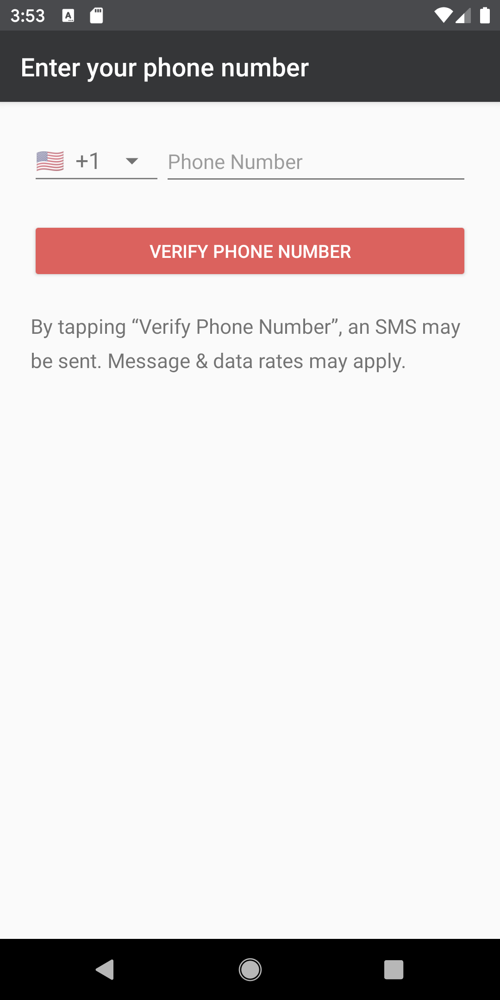

# BloodBank
A virtual Bloodbank application that connects donors and recepients using ViewModel Architecture and Firebase Realtime database and Firebase UI auth.  

[Download Beta version from PlayStore](https://play.google.com/store/apps/details?id=elixer.com.bloodbank)

# Watch it in Action

### Screenshots

  

# Usage

  * Uses crowdsourcing to obtain donor's location and bloodtype
  * Anyone can start to query donors with matching bloodtype for a specific location and radius
  * Once donors are found,notifications are send to them
  * The donor's phone number is shared in responses tab if they agree to the request made.

