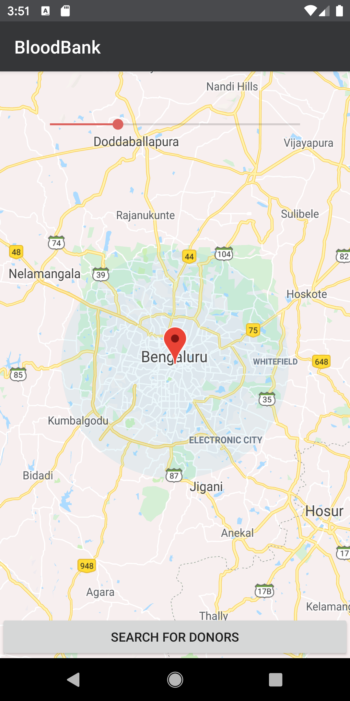

# BloodBank
A virtual Bloodbank application that connects donors and recepients using ViewModel Architecture and Firebase Realtime database and Firebase UI auth.  

[Download Beta version from PlayStore](https://play.google.com/store/apps/details?id=elixer.com.bloodbank)

### Screenshots

 

